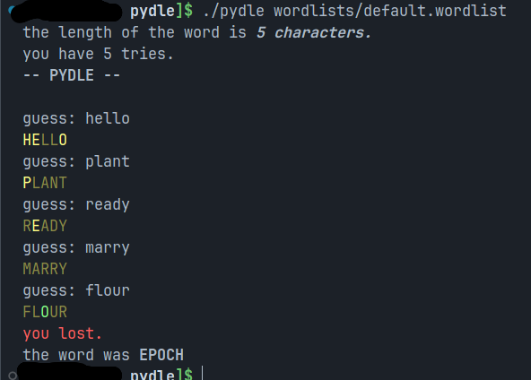

# pydle

## how to play

execute "pydle" on a terminal and write the path of the wordlist file.\
to test, you can download the [default wordlists](wordlists).

`./pydle wordlists/default.wordlist`

*(assuming a file structure like this):*

```text
┖ pydle (folder)
    ┠ pydle
    ┖ wordlists
        ┖ default.wordlist
        etc...
```

## wordlist file

to create a wordlist file, create a text file with the ".wordlist" extension and write all the words you want to add.\
every word is divided by new lines.\
for example:

```text
apple
orange
berry
```

## screenshots


